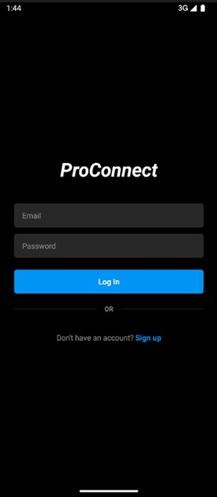
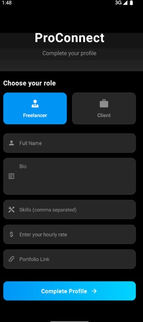
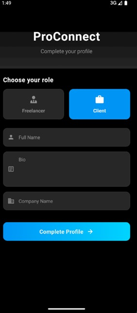
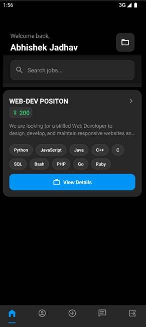
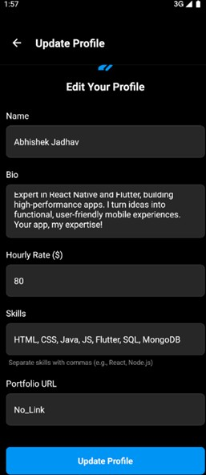
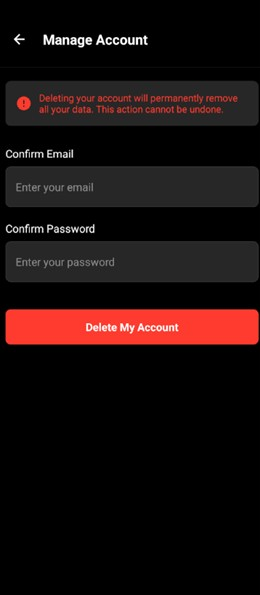
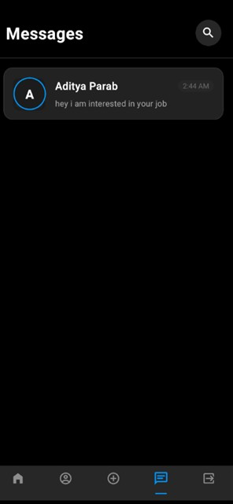
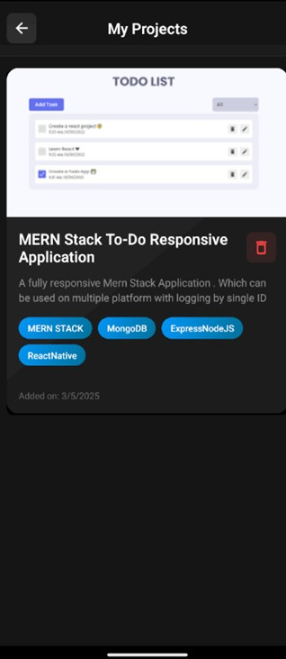
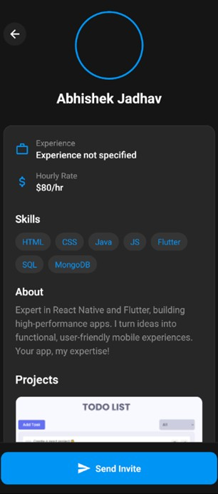

# 📱 ProConnect – Freelancing App

ProConnect is a mobile app that helps clients and freelancers connect and work together easily.

## ✨ Features

- 🔐 Easy sign up and login for clients and freelancers  
- 📄 Clients can post jobs with budget and time details  
- 🔍 Freelancers can search and apply for jobs  
- 💬 In-app chat to communicate  
- 🎨 Simple and clean design

## 🚀 How to Use

1. **Download** and install the ProConnect APK on your Android device  
2. **Sign up** as a client or freelancer  
3. **Post jobs** (for clients) or **apply for jobs** (for freelancers)  
4. Use the **chat** to discuss and collaborate  

## 🛠 Tech Stack

- **React Native (Expo)** – for app development  
- **Firebase** – for authentication, database, and chat  

## 📌 Notes

- This is a basic version. More updates coming soon  
- Please report bugs or issues for improvement  
## Screenshots
<table border="0">
  <tr>
    <th>SignUp</th>
    <th>Login</th>
    <th>Create Freelancer</th>
  </tr>
  <tr>
    <td></td>
    <td></td>
    <td></td>
  </tr>

  <tr>
    <th>Create Client</th>
    <th>HomePage - Freelancer</th>
    <th>Settings</th>
  </tr>
  <tr>
    <td></td>
    <td></td>
    <td></td>
  </tr>

  <tr>
    <th>Update Profile</th>
    <th>Manage Account</th>
    <th>Chatlist Screen</th>
  </tr>
  <tr>
    <td></td>
    <td></td>
    <td></td>
  </tr>

  <tr>
    <th>ChatScreen</th>
    <th>Projects Screen</th>
    <th>Freelancers Profile</th>
  </tr>
  <tr>
    <td></td>
    <td></td>
    <td></td>
  </tr>
</table>
